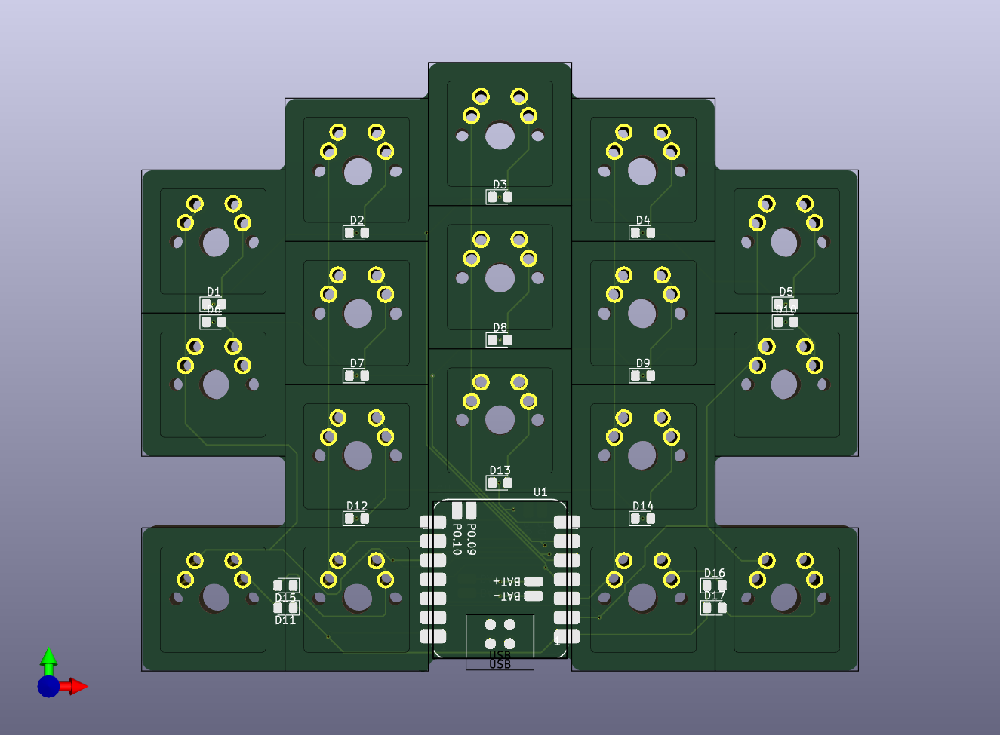
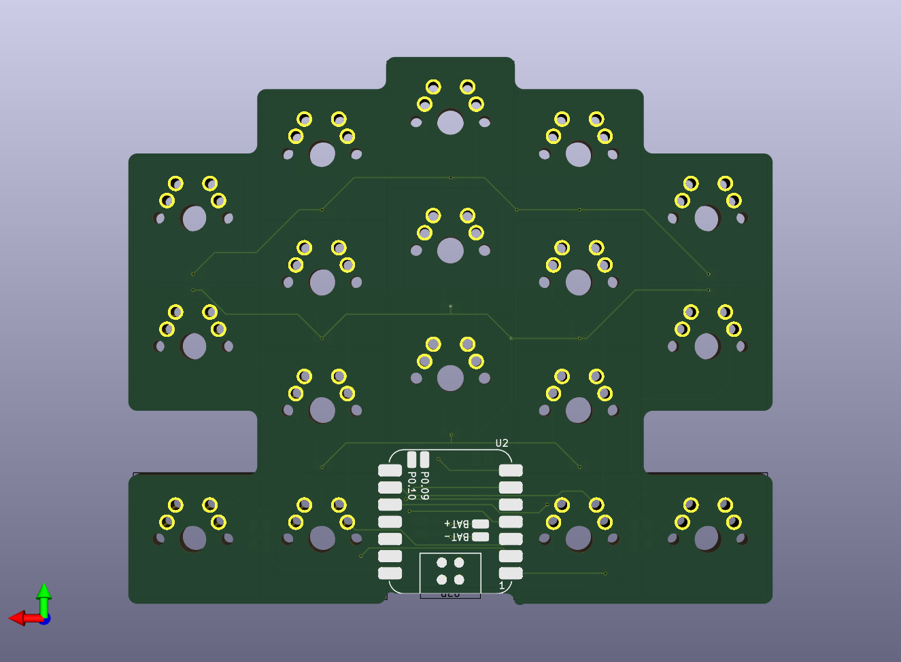

The space-invader was conceptualized [kilipan](). I liked the idea so much that I realized the board.

A single board can be used as a macropad, but it really shines, when two boards are used together. Then it acts like a split [humming bird keyboard]().
The board uses [XIAO-BLE]() controllers.
