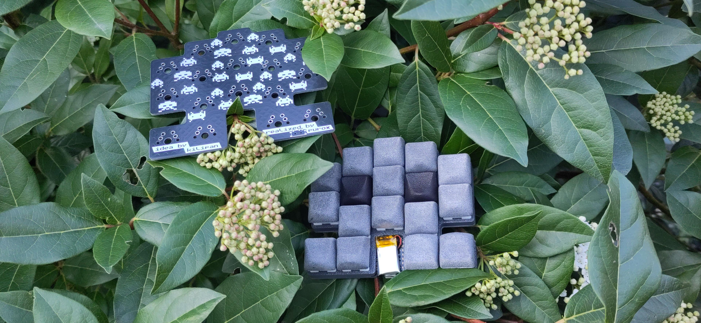

The space-invader was conceptualized [kilipan](https://github.com/kilipan). I liked the idea so much that I realized the board.

A single board can be used as a macropad, but it really shines, when two boards are used together. Then it acts like a split [humming bird keyboard](https://github.com/PJE66/hummingbird).
The board uses [XIAO-nRF52840](https://wiki.seeedstudio.com/XIAO_BLE/) controllers.

# Buildguide

Before we start, I need to clarify some nomenclature:
I'll refer to side of the PCB with the silkscreen credits as the bottom side.

Solder the diodes to the top side of the PCB. Be careful with the orientation of the diodes! The closed side of the silkscreen on the PCB marks the cathode (the side of the diode with the line on it).
Next solder in the XIAO face down, i.e. such that its components are visible from the bottom side of the PCB.

If you want to use the on/off switch for the battery solder it onto the bottom side of the PCB. Then solder the positive side of the battery to the pad labeled `BAT+` on the front side of the PCB. Next solder a cable from the pad labeled `MCU+` on the PCB to the pad labeled `BAT+` on the XIAO. Finally solder the negative side of the battery directly to the XIAO.

In case you don't want to use the on/off switch solder the battery directly to the battery pads on the XIAO.

When installing the switches you have a choice. As the PCB is reversible, you can install the switches from both sides.
It you want to use a plate, you have three options, there is one [universal plate](plate_reversible.stl), which can be used with both PCB orientations, but you will have cutouts on the top of the plate.
The [plate_top_holes.stl](plate_top_holes.stl) is designed to be used with the switches installed from the top. And [plate_bottom_holes.stl](plate_bottom_holes.stl) is designed to be used with the switches installed from the bottom.
Install the switches through the plate into the PCB and solder them to the PCB.

# Flashing firmware
The firmware for this board can be found at [https://github.com/ThePurox/space-invader-zmk/](https://github.com/ThePurox/space-invader-zmk/).
